# Terra Space: Pre-Reset Pipeline Guide

## Superseded

On 2026-08-24, the owner approved a reset of the former end-to-end pipeline. Four workflows
(**Full News Processing**, **Event Candidates**, **Event Records**, and **Issue-first Analysis**)
and all associated Terra Space tables were deleted. Only **Input News Manual** and the two retained
Phase 1 tables remain. This document is preserved as historical reference only and must not be used
as instructions for current operation. See [Current Status](Current-Status.md) for the new starting
point.

The rest of this document describes the former pipeline.

## 1. The one thing you normally do

Submit an article through **Terra Space - Full News Processing**.

You do not need to manually run the other workflows. They are connected stages that Full News
Processing calls for you.

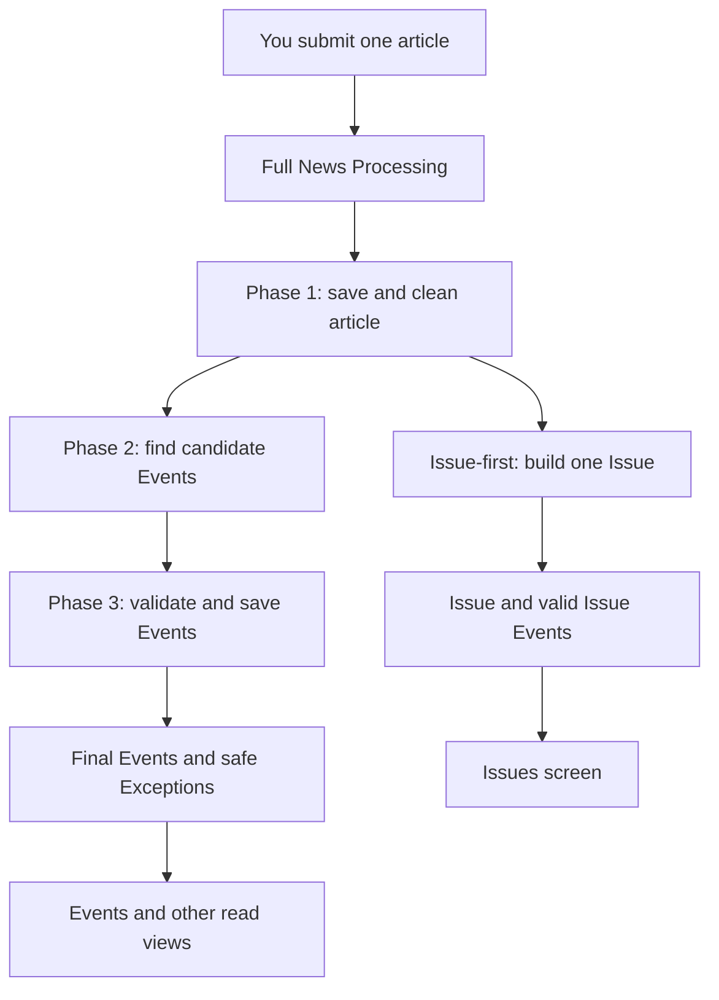

Two paths begin after Phase 1:

- The **Event path** finds detailed Events and validates them in Phase 2 and Phase 3.
- The **Issue path** creates one article-level Issue and its related Issue Events.

They run independently. Therefore, an article can have valid Events even if it has no valid Issue,
or a valid Issue even if some Phase 3 Events are retained as exceptions.

## 2. The five live workflows

| Workflow | What starts it | Its job | What it produces |
| --- | --- | --- | --- |
| **Terra Space - Full News Processing** | Your normal article form | Coordinates the complete flow | A completion summary for that article |
| **Terra Space - Phase 1 - Input New Article** | Full News Processing, or its own form | Saves and cleans the article | One Phase 1 source article and run history |
| **Terra Space - Event Candidates** | Full News Processing, or controlled single-source rerun | Finds a main issue and possible Events | One Phase 2 candidate result and run history |
| **Terra Space - Event Records** | Full News Processing, or controlled single-source rerun | Enriches, checks, classifies, and saves Events | Final Events or safe Exceptions, plus run history |
| **Terra Space - Issue-first Analysis** | Full News Processing, or controlled single-source rerun | Creates a validated article-level Issue | One valid Issue, valid Issue Events, and optional relationships |

The four individual stages also have controlled UUID/chat entries. Those are for diagnosis or a
targeted reprocess. They are not the everyday way to add an article.

## 3. Full flow, step by step

### Step A — Phase 1: save and clean the article

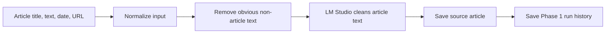

Phase 1 stores both the original text and cleaned text. The original is preserved so every later
claim can be checked against the submitted article. Cleaning is not permission to invent facts.

### Step B — Phase 2: find candidate Events

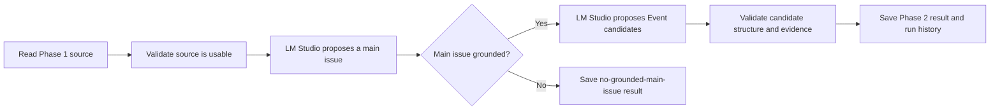

At this stage, an Event is still a candidate. The system may find several candidates from one
article. A candidate is not yet a final Event shown as a trustworthy record.

### Step C — Phase 3: turn candidates into safe Event records

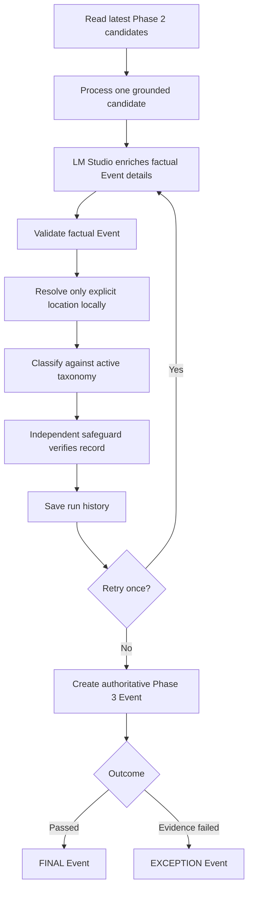

Phase 3 has several safeguards:

- It checks that facts have evidence.
- It resolves a location only from explicit article information and local reference data.
- It classifies only against the active Event taxonomy.
- It uses an independent safeguard before an Event becomes `FINAL`.
- If a result cannot pass, it is kept as an `EXCEPTION` with its history instead of being silently
  discarded or manually repaired.

An `EXCEPTION` is a safe pipeline outcome, not a request for you to guess missing facts.

### Step D — Issue-first: create one article-level Issue

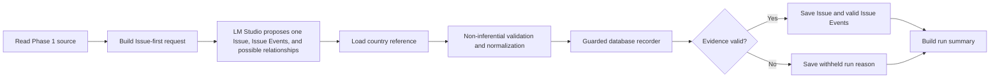

Issue-first does not edit Phase 3 Events. It makes a separate analytical result for the Issues
screen, based directly on the source article.

The current `issue-first-v3` rule is deliberately strict:

- A Main Issue needs an exact evidence quote from the article.
- Each Issue Event stays only when its own title and quote are directly supported.
- A relationship stays only when the complete relationship evidence is supported.
- The pipeline never repairs a quote, fills in a missing actor, substitutes a country, or guesses a
  location.

## 4. Events, Issues, and relationships are different things

| Item | Meaning | How many can an article have? | Can it exist without a relationship? |
| --- | --- | ---: | --- |
| **Phase 3 Event** | A detailed, independently validated occurrence | Many | Yes |
| **Issue** | One concise statement of the article's main situation | Normally one | Yes |
| **Issue Event** | A validated Event shown inside the Issue analysis | Many | Yes |
| **Relationship** | A map line from one explicit actor/location to another | Zero or more | Not required |

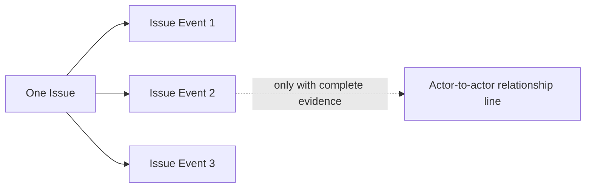

A missing relationship line does **not** invalidate an Issue or Event. It only means the article
did not explicitly prove all details needed for a safe map connection.

## 5. Relationship evidence rule

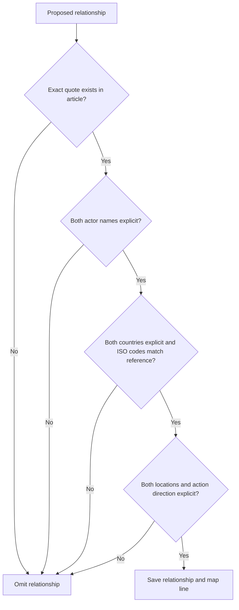

Only a fully supported relationship is saved. The pipeline does not turn abbreviations, nearby
context, or general knowledge into a location or actor relationship.

## 6. Data scheme: where the information lives

The database has two related output families:

- **Phase 1 / 2 / 3 tables** hold the article and detailed Event pipeline.
- **Issue-first tables** hold the separate Issue analysis used by the Issues screen.

### Detailed Event pipeline data

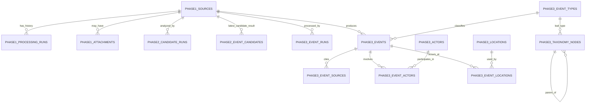

| Table group | What it stores | Why it matters |
| --- | --- | --- |
| `terra_space_phase1_sources` | Original article, cleaned text, source details, processing status | The durable source of evidence |
| `terra_space_phase1_processing_runs` | Cleaning attempt history | Shows what Phase 1 did |
| `terra_space_phase2_candidate_runs` and `terra_space_phase2_event_candidates` | Main issue and possible Events proposed in Phase 2 | Keeps candidate output and audit history separate from final Events |
| `terra_space_phase3_event_runs` | Per-candidate enrichment, validation, taxonomy, safeguard, retry, and error history | Explains why an Event became final or exception |
| `terra_space_phase3_events` | Authoritative Phase 3 Event records | Holds `FINAL` or `EXCEPTION` outcomes and human-status fields |
| `terra_space_phase3_event_sources`, `_actors`, `_locations` | Evidence links, actors, and locations belonging to an Event | Lets one Event have multiple evidence links, actors, and locations |
| `terra_space_phase3_actors`, `_locations`, `_event_types`, `_taxonomy_nodes` | Reusable reference records | Keeps names, map coordinates, and taxonomy consistent |

### Issue-first data

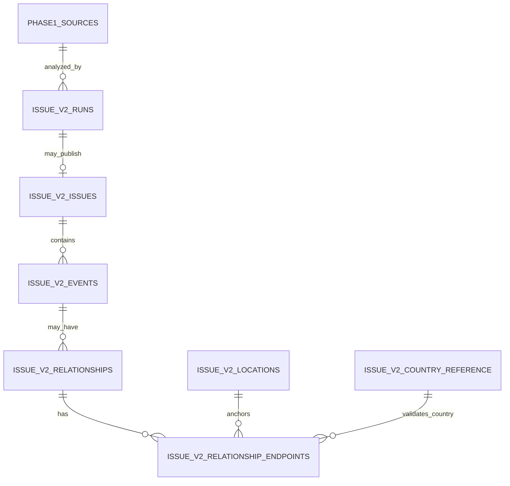

| Table group | What it stores | Why it matters |
| --- | --- | --- |
| `terra_space_issue_v2_runs` | Every Issue-first attempt, status, reason, raw output, model and prompt version | Preserves success and withholding history |
| `terra_space_issue_v2_issues` | The evidence-backed Issue for one source article | The main analytical record |
| `terra_space_issue_v2_events` | Valid Issue Events belonging to that Issue | Supports the Issue view without changing Phase 3 Events |
| `terra_space_issue_v2_relationships`, `_endpoints`, `_locations` | Optional actor-to-actor map relationships and their explicit endpoints | Stored only when complete relationship evidence exists |
| `terra_space_issue_v2_country_reference` | Country name to ISO-3 reference data | Checks country/ISO consistency without guessing |
| `terra_space_issue_v2_valid_*` views | Read-only prepared lists of valid Issues, Events, and relationships | Powers the Issues API and UI safely |

## 7. What the application reads

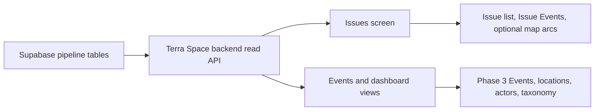

The Issues screen is read-only. It displays only the prepared valid Issue-first results. It is not a
place to approve, correct, or invent data.

## 8. Where a result can stop—and why that is safe

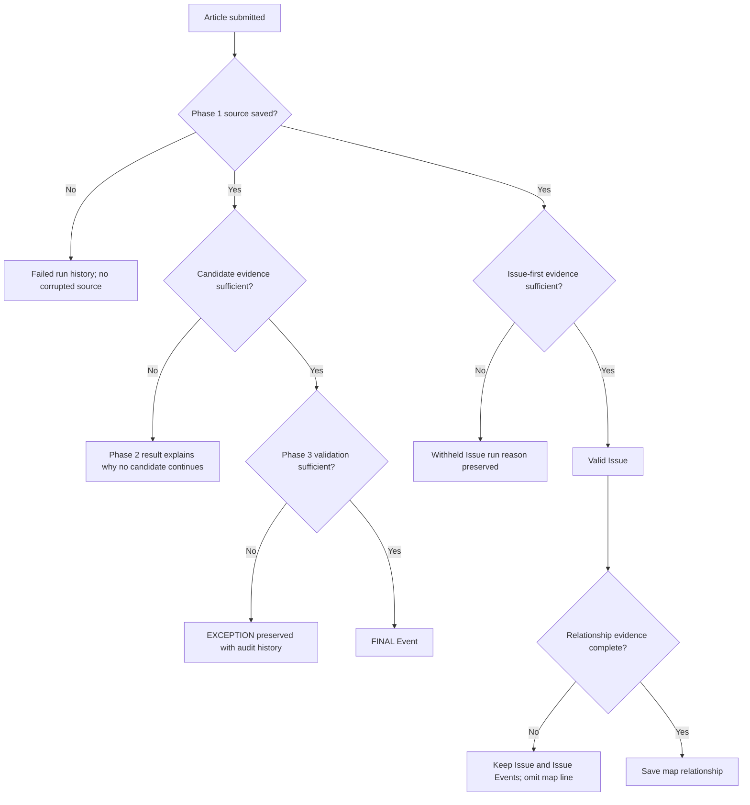

The important rule is: **failure of an optional or unsupported detail never gives the system
permission to invent that detail.** It either records a safe exception/withheld reason or omits the
optional relationship.

## 9. Retired workflows

The following inactive experiments are preserved in the n8n folder **Terra Space — Retired (do not
run)**. They are not part of the current pipeline and must not be reactivated without a new owner
decision:

- `Terra Space - GDELT DOC Scheduled Collector (SEA/ASEAN/SCS)`
- both `Terra_Space_Event_detection_v1` copies
- `Terra_Space_Event_detection_test`
- `Terra_Form_News_Articles`
- `Terra Space — Geopolitics News + Article Scraper`

Automatic news collection and scraping are deferred beyond the current MVP. The live workflow
boundary is recorded in [Active Workflow Boundary](decisions/Active-Workflow-Boundary.md).

## 10. Practical checklist

For a normal new article:

1. Confirm Supabase, n8n, LM Studio, and Terra Space are running.
2. Submit through **Full News Processing**.
3. Wait for `COMPLETED`.
4. Look at **Issues** for the validated Issue result.
5. Treat an `EXCEPTION`, withheld Issue, or missing relationship line as a pipeline evidence
   outcome—not something to fix by hand.
6. If the output appears wrong, improve the responsible pipeline step and reprocess the source;
   preserve the original data and run history.

## Navigation

- [Project Knowledge](Project-knowledge-Index.md)
- [Current Status](Current-Status.md)
- [Issue-first Independent Evidence Retention](decisions/Issue-First-Independent-Evidence-Retention.md)
- [Active Workflow Boundary](decisions/Active-Workflow-Boundary.md)
