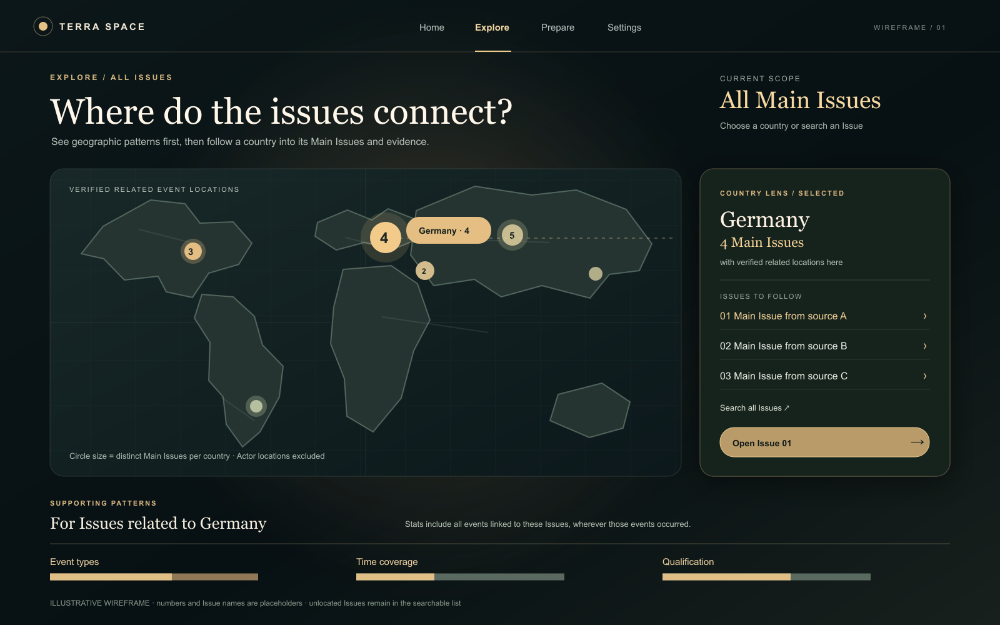
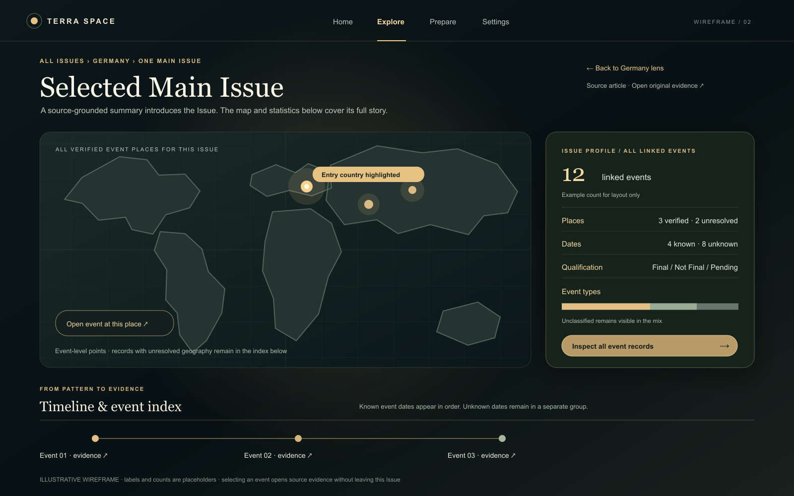
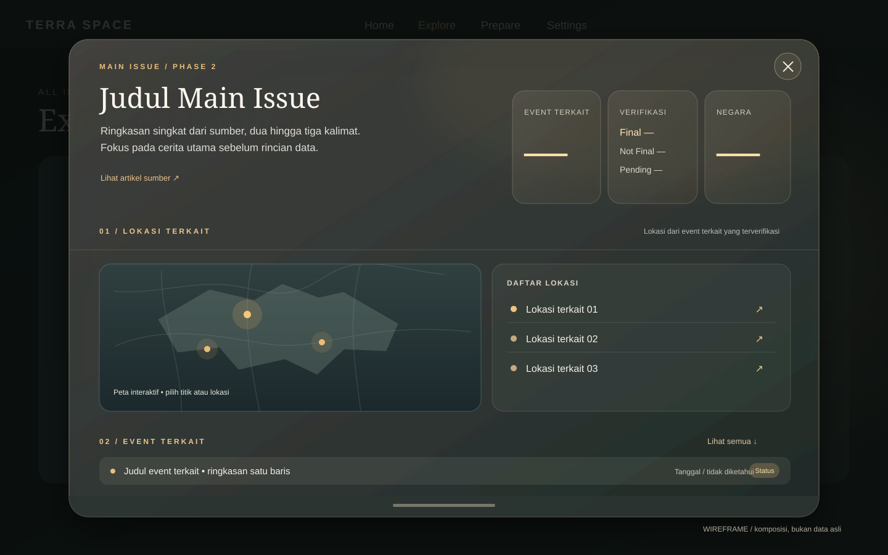

# Context

The owner wants Explore to reveal patterns across current Phase 2 Main Issues, then support a
deeper statistical investigation of one Issue. Home already introduces an Issue and the broad
landscape. The current Explore has an Issue browser, event map, timeline, index, and evidence
detail, but its equal-weight sections do not yet express the desired two-layer journey.

This brief refines [Phase 2 Main Issue Led Terra Insight](Phase-2-Main-Issue-Led-Terra-Insight.md)
without changing its source-linked data relationship. The owner reviewed the two wireframes,
found the direction mostly right, and approved implementation.

# Decision

## Aim and journey

Explore answers **what patterns appear across all Main Issues**, then lets the user investigate
one Issue and trace its statistics to events and evidence.

1. **All Issues: helicopter view.** Start with place as the leading dimension. A country map
   counts distinct Main Issues with verified related Event Geography there. Supporting views
   describe event type, time, qualification, and missing data for the current Issue set.
2. **Country lens.** Selecting a country highlights it and narrows the Issue list to Issues
   with a verified related event location there. Supporting statistics update to those Issues
   and **all their linked events**, with an explicit label such as “Issues related to Germany.”
   They must never be described as only “events in Germany.”
3. **One Issue: drill-down.** Selecting an Issue opens a large centered, scrollable subwindow
   over the dimmed overview. It reveals the full story: all its verified related places and all
   its linked events, including events outside the country that led to it. The title and short
   source-grounded story lead, with compact figures for linked events, Phase 5 qualification
   (Final, Not Final, Pending), and distinct countries with verified related locations beside it.
   A compact map with a location list follows, then a scannable event list, timeline, and evidence.
   The entry country remains context; closing the subwindow returns to that country lens or the
   full overview at the same scroll position.
4. **Evidence.** Event type, qualification, date state, timeline, and event records are
   interactive routes to the underlying event and source evidence, without losing the current
   Issue context.

## Measures and data boundaries

- A Main Issue remains one current Phase 2 source-grounded Issue identified by its Phase 1
  source ID. Phase 5 events link through that same source ID. Similar labels from different
  sources are not merged.
- An Issue counts once per country when one or more of its linked Phase 5 events has resolved
  Event Geography with a valid coordinate and country ISO3 code there. An Issue may count in
  multiple countries, so country counts need not add up to the total Issue count. Actor
  locations and inferred Issue coordinates do not enter this measure.
- Country selection creates a set of Issue IDs. Every supporting event statistic counts the
  linked retained Phase 5 events for that set once by event ID. An event may have a location
  outside the selected country; labels must disclose that scope.
- The single-Issue profile shows linked event total, verified place coverage, event-type mix,
  qualification, and known versus unknown event dates. The event map shows resolved event
  locations; the record list retains events without resolved geography. Publication dates are
  references, never substituted for unknown event dates.
- Show `FINAL`, `NOT_FINAL`, and pending separately where qualification is summarized. Missing
  event types remain **Unclassified**. Missing dates and unresolved locations remain visible
  as coverage gaps, not zeros or guessed positions.
- Issues without a verified country remain accessible in a clearly labeled unlocated group
  and searchable Issue list. Selecting one still opens its full Issue detail and evidence.
- Counts derive from current data. A loading or failed request cannot appear as an empty set.

## Interaction and presentation

- The default Explore URL opens All Issues. Country and Issue selections should be shareable
  and survive back navigation, following the existing query-parameter pattern.
- The overview map, country list, and Issue list stay synchronized. A selected country has a
  plainly stated count and an obvious clear-selection action. A user can search for an Issue
  without first finding it on the map.
- The Issue drill-down uses warm, softly rounded glass surfaces over the visible overview,
  direct routes to event records and evidence, and a flat map linked to the location list.
  It should feel visually connected to Home's cinematic style while keeping labels, controls,
  and missing-data notes easy to read. On narrow screens, the same subwindow nearly fills the
  viewport and stacks the story, figures, map, locations, and records in that order.
- On narrow screens, preserve the same order of understanding: scope, place, Issue choice,
  statistics, then evidence. Map interaction must have an equivalent list path. Motion must
  honor the appearance motion switch and reduced-motion preference.

## Wireframes for joint review

These are layout and interaction studies. Their country counts, Issue names, event counts,
and map shapes are illustrative, not product data or a final map projection. The first frame
shows a selected country; clearing it restores the full all-Issues overview. The earlier second
frame records the original full-page drill-down; the third, approved after owner review,
supersedes its composition with a centered subwindow and story-first hierarchy.

## Implementation checks

- A country containing several linked events for one Issue counts that Issue once.
- A multi-country Issue appears in each relevant country but opens with every related place
  and event visible.
- Country-lens supporting charts count all events linked to selected Issues, not only events
  geographically inside the country, and label that scope clearly.
- Unlocated Issues, unclassified events, unknown dates, and unresolved event geography remain
  accessible and correctly described.
- Event or source detail can be opened and closed without losing country and Issue context.
- Desktop and narrow-screen wireframes make the two layers and the route between them clear.

# Alternatives considered

- **Separate overview and detail tabs:** simple navigation, but the relationship between a
  geographic pattern and the Issue behind it would be less direct.
- **Guided story:** strong showcase sequence, but slower for everyday investigation and less
  flexible when the user wants a particular country or Issue.
- **Event counts per country as the primary map:** useful for event density but would make
  events, rather than Main Issues, the leading unit of the overview.

# Reasons

The map-guided path connects a broad pattern to a traceable Issue and then to its events and
source evidence. It preserves the Issue-led North Star while adding analytical depth beyond
Home's introductory overview. Explicit scopes prevent a country selection from implying that
every event in a selected Issue happened in that country.

# Consequences

The two-layer Explore UI now implements this path with a country overview, country lens,
single-Issue stage, event timeline, event index, and source evidence. The next step is visual
review with live data when local Supabase is running. This decision does not authorize database,
pipeline, or n8n changes.

# Navigation

- [Decisions Index](Decisions-Index.md)
- [Project Knowledge](../Project-knowledge-Index.md)
